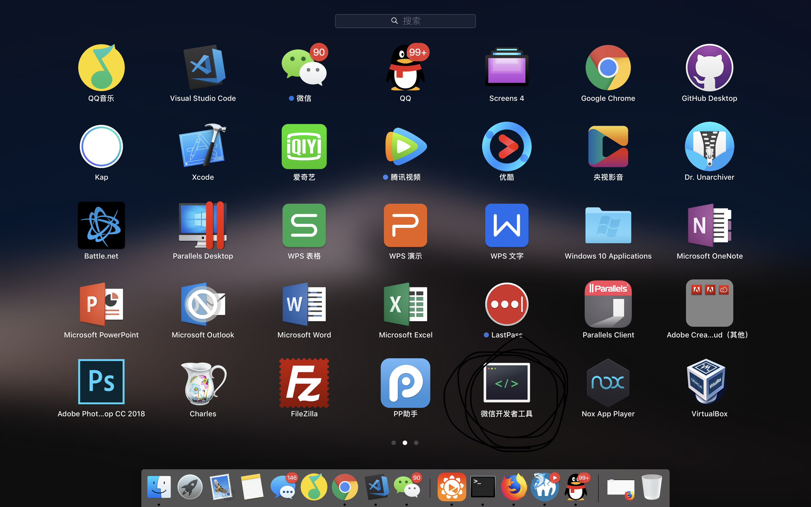
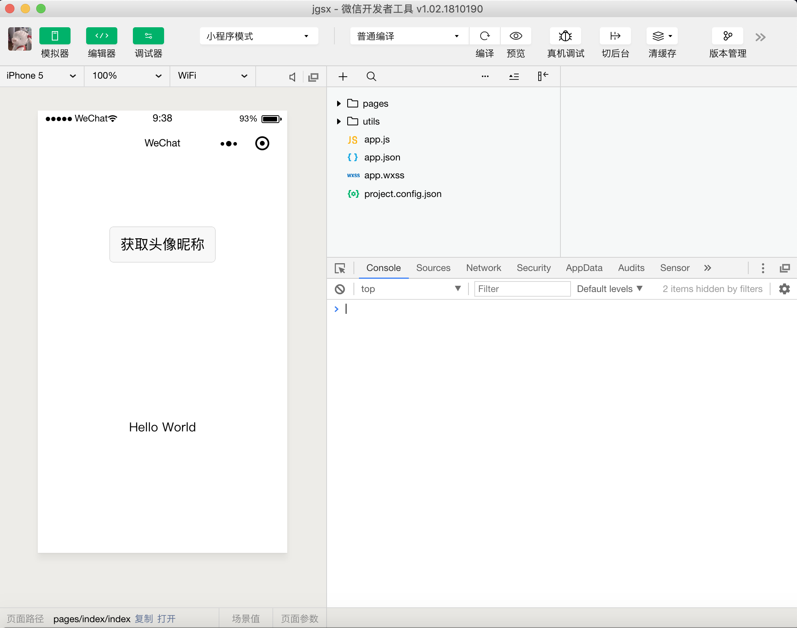

# 微信公众平台

[微信公众平台](https://mp.weixin.qq.com/)

# 注册

[注册小程序的账号](https://mp.weixin.qq.com/wxopen/waregister?action=step1&token=&lang=zh_CN)

注册选择个人

# 下载开发者工具

[微信开发者工具](https://developers.weixin.qq.com/miniprogram/dev/devtools/download.html?t=18122618)



点击启动微信开发者工具,初始化第一个项目，如果成功则如下图所示




# JSON配置文件

## 全局配置
是对你的应用进行全局或者局部配置，它能控制你的头部，底部，背景，实现上拉下拉刷新等方法
```json
{
  "pages":[
    "pages/index/index",
    "pages/logs/logs"
  ],
  "window":{
    "backgroundTextStyle":"light",
    "navigationBarBackgroundColor": "#fff",
    "navigationBarTitleText": "WeChat",
    "navigationBarTextStyle":"black"
  }
}
```
## 局部配置

可以把全局配置的`window`属性值放在该页面单独设置

# wxml

页面可以初始化一些数据
```js
Page({
  /**
   * 页面的初始数据
   */
  data: {
    name:"layao",
    skill:['ps','js','css'],
    age:18
  }
})
```
配合微信的模板语法`{{}}`,把上面data里面的数据绑定到wxml文件上显示
```html
<text>演员</text>
<text>{{name}}</text>
<text>技能</text>
<text>{{skill}}</text>
```

单向数据驱动  数据变视图一定变({{{}}})，但是视图变数据不一定，视图变想导致数据变必须用（setData）
数据影响视图({{}})
M->V

视图影响数据(setData)
V->M